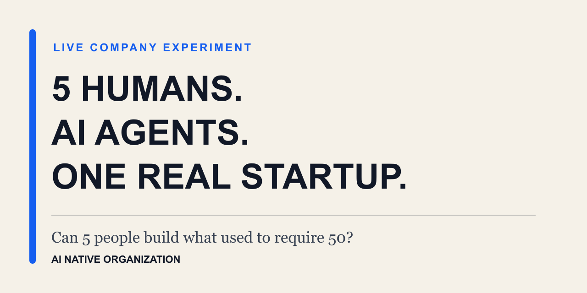

# AI Native Organization

English | [中文](README.zh-CN.md)

**A live experiment in rebuilding a company around AI.**

> Can 5 humans build what used to require 50?

## The experiment in 30 seconds

Ingora is a five-person startup trying to operate across a capability surface that might once have required dozens of people: research, product, software, testing, operations, finance, compliance, and more.

AI agents make that range possible. They do not make the team equivalent to a 50-person company.

That distinction is the experiment.

When execution becomes easier to obtain, judgment, taste, organizational memory, governance, and feedback may become the real constraints. We are documenting what happens while we test that idea inside a real company—including the moments when it works, fails, or produces a result we do not yet understand.

## Start with two stories

### ✅ Worked—with governance limits

[**The Founder Was Away for 9 Days. The Company Kept Learning**](stories/001-founder-away.md)

While the founder had very limited time to read during a trek in Kazakhstan, the company knowledge system continued collecting and processing information. It produced nearly 200 candidate knowledge items—but none became company memory without human review.

### 💥 Failed

[**We Thought We Didn’t Need Engineers—Until We Found a 30,000-Line File**](stories/002-we-thought-we-didnt-need-engineers.md)

AI helped two experienced product and technology leaders cross a boundary they had not crossed in years. It also helped them build an architectural crisis faster than they expected.

## What this is

This repository is a public, ongoing record of the experiments behind Ingora:

- What did we try?
- What actually happened?
- What surprised or contradicted us?
- What question are we testing next?

The outcome is unknown. That uncertainty is part of the project.

## What this is not

This is not an open-source book, a generic AI management guide, or a claim that AI can replace every specialist.

A related book project examines the full context, frameworks, implementation methods, and management implications. This repository stays with the observable story. It deliberately excludes book chapters, diagnostic toolkits, internal prompts, proprietary workflows, and sensitive company information.

## Follow the experiment

We plan to publish one bilingual episode every two weeks. The [Experiment Roadmap](roadmap/experiments.md) shows the next questions without revealing the answers in advance.

Status markers:

- ✅ Worked
- 💥 Failed
- 🧪 Testing
- ⏳ Planned

If you want to know what happens next, **[star this repository](https://github.com/jackyhsu/ai-native-organization)** and join the [Discussions](https://github.com/jackyhsu/ai-native-organization/discussions).

## About Ingora

Ingora is a Singapore company experimenting with what it means to build an AI-native organization. At this early stage, access to AI talent and hardware supply chains matters, so many of the stories in this repository take place inside its Shanghai subsidiary in China.

The experiment is led by **Jacky Hsu**, who spent nearly 25 years in the technology industry at Microsoft before founding Ingora in 2026.

Read [why we are running this experiment](about/why-this-experiment.md) and the short [Ingora background](about/ingora.md).

## Participate

Use [Discussions](https://github.com/jackyhsu/ai-native-organization/discussions) for questions and ideas about the experiments. Use [Issues](https://github.com/jackyhsu/ai-native-organization/issues) only for factual corrections, broken links, or differences between the English and Chinese versions.

See [CONTRIBUTING.md](CONTRIBUTING.md) before opening an issue or pull request.

## License

Unless otherwise noted, the written content is licensed under [CC BY-NC-ND 4.0](LICENSE): you may share it with attribution for non-commercial purposes, but may not distribute modified versions.

— **Jacky Hsu**
