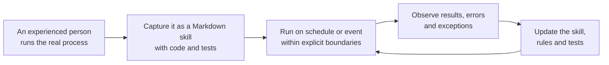

# We Thought We Didn’t Need Engineers—Until We Found a 30,000-Line File

English | [中文](../zh-CN/stories/002-we-thought-we-didnt-need-engineers.md)

**Status: 💥 Failed**

**By Jacky Hsu**

## Chapter Four: When AI can run in parallel 24/7, what is the company’s real bottleneck?

For a while, our biggest concern at night was running out of tokens.

During the day, we discussed product features, looked for partners, and handled company operations. By the time we could use AI without interruption, it was often already late at night. We watched our allowance fall and calculated how many conversations, rounds of revision, and pieces of work we could finish before the limit reset.

Then we upgraded our model plan and received a larger allowance. We encountered a problem that had previously been difficult to imagine: we could not use all the tokens.

That should have been a relief. Instead, we began staying up late so they would not “go to waste.”

Research one more competitor. Generate one more feature. Ask an agent to check one more regulation. Revise one more interface. The screen showed no sign of fatigue, and the agent did not remind us that it was already two in the morning. As long as we continued issuing instructions, more text, code, and proposals kept appearing.

For a time, we developed an almost dangerous feeling:

If AI never sleeps and tokens are abundant, can a company produce without limit?

This stage later acquired a vivid name: Tokenmaxxing—turning as many available tokens as possible into work. For a startup team that had just experienced the kind of productivity shock described in the second chapter, the temptation was powerful. Yesterday we were anxious because we had no engineers. Today, it seemed that we had a digital team that was always available and never needed to rest.

Then our application began to fail repeatedly.

## From “we can build anything” to “we should hire engineers”

The first problems all looked small.

A feature broke, so we asked AI to fix it. After the fix, another feature that had been working stopped. We asked AI to repair the second one, only to see the first fix fail again. We were running through a leaking house: as soon as one hole was sealed, water came through another wall.

In every conversation, AI sounded confident.

It explained the cause, listed the changes, and told us that the tests had passed. Locally, each answer seemed reasonable. Globally, the product increasingly resembled a structure built one layer on top of another, ready to shake when lightly touched.

My cofounder’s emotions moved like a roller coaster.

One moment, after doing in three weeks much of what an outsourced team had taken months to build, he felt as if he could do anything. The next, he watched a recently repaired feature break again and said with a bitter smile:

“We should hire engineers after all.”

During the Vibe Coding stage, we rarely opened the IDE or looked at the code.

It was not because code did not matter. The experience was simply too smooth: describe the requirement, wait for the output, install the app, and test it. As long as the feature worked, the code felt like the parts under a car’s hood—the driver did not necessarily need to know how they were arranged. We also had to admit that neither of us could fully understand the code inside, so we chose not to look.

The problem was that we were not building a cardboard car to be discarded after one drive.

The product had to keep gaining features. It had to connect to cloud services, handle data from children and parents, support different devices, and survive changes made by different people and different agents at different times. Eventually, we realized we could no longer add features safely. For the first time, we opened the code and examined it closely.

We were shocked.

The Android front end alone had accumulated more than 30,000 lines of code in a single file. There were no clear module boundaries or files separated by responsibility. Calls to the back end were scattered across the code, and one state change could affect several seemingly unrelated features. Every earlier “quick fix” may have introduced new coupling somewhere we could not see.

Thirty thousand lines were not the most frightening part.

The frightening part was that every line could have been a reasonable response to a reasonable request.

## If AI understands software engineering, why did it still build a fragile tower?

AI certainly knows about MVC, global variables, interface abstractions, modularity, layered architecture, microservices, and test-driven development.

Ask it directly, “How should a maintainable mobile application be designed?” and it can produce a polished answer in seconds. Give it a piece of code to review, and it may accurately identify coupling, duplication, and state-management problems.

But the task we gave it was not: “Design a product architecture that can continue to evolve.”

We said:

- “Add this button.”
- “Connect the voice pipeline.”
- “This page is crashing. Fix it quickly.”
- “Do not break the features that already work.”

AI worked hard to answer one local question after another, but it was never asked to take responsibility for the long-term coherence of the whole system. It optimized for the success of the current conversation, not for whether the system would remain understandable, testable, and extensible after another hundred changes.

This revealed a question more important than whether AI can write code:

Knowledge inside a model does not automatically become a constraint on the current task.

An agent can know every principle of software engineering and still create technical debt continuously when architecture, context, tests, and acceptance criteria are missing. Imagine an experienced architect who is repeatedly told only to “add another room here,” while being denied a view of the building’s structure and the authority to reject dangerous changes. The result can still be a fragile tower.

This is the distinction described earlier: Vibe Coding raises the floor for “making something,” while Agentic Engineering raises the ceiling for “continuing to build a product.”

What we did next was not switch to a stronger model. We painfully tore the system down and rebuilt the architecture. We defined modules and interfaces before asking agents to modify them. We wrote acceptance criteria before generating code. We made tests, static analysis, code review, and runtime feedback part of every development cycle.

This was the beginning of Harness Engineering: not searching for a more magical sentence to say to an agent, but designing an environment in which correct behavior is easier, mistakes are visible, and the same failure is less likely to recur. One item in Ingora’s knowledge base expressed the principle directly: whenever an agent makes a mistake, turn that failure into a rule, test, architectural constraint, or feedback mechanism so the system does not depend on someone remembering the warning next time.

We thought we needed more tokens.

We eventually understood that we needed a system for governing them.

## Token consumption is not output

Suppose Company A uses ten times as many tokens per day as Company B.

Modern multi-agent architectures may allow Company A to run tens or even hundreds of agents, subagents, or independent sessions at the same time. A lead agent decomposes the task, while other agents process parts in parallel. We use this method ourselves when analyzing one or two hundred news articles. If the work can be divided sensibly, the wall-clock time for a previously sequential task can theoretically fall to nearly one tenth.

But this does not prove that Company A produces ten times as much useful output as Company B.

It proves only that Company A consumes ten times as much compute.

Large amounts of machine time may be spent on:

- the wrong direction;
- duplicated work;
- research unrelated to a decision;
- large quantities of low-quality code that cannot be maintained;
- repairing problems created by an earlier repair;
- agents waiting for one another or producing conflicts;
- rereading and reasoning again because context is missing;
- completed work that waits too long for human review.

All these tasks are running. They may produce impressive-looking logs, and they all consume tokens.

But the company has not necessarily moved forward.

The industrial era made it easy to mistake hours worked for output. The AI era makes it easy to mistake tokens, calls, and volume generated for output. Both errors share the same cause: treating inputs as results.

Real output must pass a stricter test. Did it change the product, the customer, revenue, risk, decision quality, or the organization’s next action? Can it be verified, used, and maintained? When it fails, does it leave behind reusable learning?

If the answer is no, a billion tokens may only produce inventory faster.

## Covering the work of forty or fifty people is not the same as having their productivity

Ingora’s founding team has only five people, yet it is attempting to cover a range that might once have required forty or fifty: strategy, industry research, product management, interaction design, front end, back end, testing, IT, data, operations, market analysis, marketing, fundraising, finance, legal work, and compliance.

Before AI, a five-person startup usually had to make brutal tradeoffs.

The work was not unimportant. The company simply lacked enough resources and people at the beginning. Even with the resources, hiring took time and new employees needed training. A team might have product and technology but no dedicated researcher; sales and operations but no security engineer; enough capacity to ship features but none to track regulations, competitors, and international markets every day.

The first thing AI changed was that a small team could enter more capability areas.

A person no longer needs to spend years becoming a full-time specialist before beginning to understand the vocabulary, draft an initial answer, execute a standard process, or speak with a real expert. AI can help someone learn quickly, break down a problem, generate a first version, and take on work that previously would never have started because the team lacked people.

But “coverage” is not “mastery,” and “starting” is not “reliable delivery.”

AI can help us enter software development, but we still need architectural judgment. It can help us enter financial and legal questions, but it cannot replace qualified professional advice carrying real responsibility. It can generate ten marketing proposals at once, but that does not mean any of them truly understand the customer.

The more accurate statement is not that five people have the productivity of forty or fifty. It is this:

For the first time, five people can reach a capability surface that might once have required forty or fifty, then concentrate scarce human experience at the points that truly determine success or failure.

AI can take us into unfamiliar fields and help us learn knowledge we did not have. But learning takes time, and judgment requires experience. If a person does not know when to doubt, what evidence counts as sufficient, or how to identify a fatal flaw in the output, AI cannot conjure that understanding from nothing.

The hard lesson we learned was:

AI can amplify capability, but it cannot amplify capability beyond the boundary of your understanding.

More precisely, AI can help expand that boundary, but it cannot make judgment that has not yet formed take effect automatically.

If a Vibe Coder does not understand software engineering, they will not naturally ask for module boundaries, dependency management, regression tests, observability, and rollback mechanisms. They will not know how far a feature that “runs now” remains from a lifecycle that can support continuous iteration.

In the past, an immature judgment might have led one person down the wrong road for a few days. Now it can direct ten agents at once and turn the same blind spot overnight into hundreds of pages, tens of thousands of lines of code, and dozens of interdependent tasks.

## Four hundred copies of you are still, first of all, you

After we experienced this roller coaster, YC president and CEO Garry Tan presented a seemingly opposite idea in an a16z interview: Vibe Coding and Agentic Coding could allow “any one person to become four hundred of that person.”

“Four hundred times” is not a rigorously measured productivity figure. It is an intentionally exaggerated expression of a trend. The part worth noticing is what follows: four hundred of that person.

If the person has product insight, architectural experience, and judgment about customer needs, AI can apply those capabilities across many tasks at once.

If the person does not know what they do not know, AI may replicate the same blind spot four hundred times.

This explains both why two Ingora leaders who had been away from hands-on development for years could use Codex to cross back into building so quickly, and why we hit the engineering wall soon afterward. Our experience building products, leading large engineering teams, and living through launches and incidents did not write the code for us. But when the tower began to shake, it helped us see that the problem was no longer one more bug. We had to rebuild the architecture and the feature lifecycle.

AI removed many barriers to hands-on execution. It did not remove the barrier of knowing what should be done and what “good” looks like.

That second ability is increasingly called taste.

## “Taste” is compressed experience, not decoration

At around nineteen minutes in the same interview, Garry Tan said that as coding agents spread, the importance of `agency` and `taste` had risen dramatically. He also emphasized that these qualities are not entirely innate. They can be trained through repeated action, failure, and reflection.

Taste here is not simply whether an interface looks good.

It is judgment compressed from a large amount of real feedback:

- Which problem deserves the company’s investment?
- Will the feature users request actually solve their difficulty?
- Does a proposal merely look complete, or does it capture the central tension?
- Does a feature work today, or does it have a structure that can be maintained?
- What should remain with an agent, and what must stop and go to a real expert?

Taste is difficult to write directly into a prompt because it usually comes from seeing many correct and incorrect results—and bearing their consequences.

An experienced engineer sees danger in 30,000 lines of code concentrated in one file. Someone who has never lived through a large software evolution may see only that “the app still opens.” A product leader who has spent years with customers may detect that a casual complaint points to a positioning failure. An agent responsible only for summarization may classify it as ordinary feedback.

AI can propose a judgment. It cannot decide for the organization which judgments deserve trust.

## Why founders aged 35–45 may be entering an advantage period

Silicon Valley has long favored stories about young founders.

Youth can mean fewer constraints, greater willingness to take risks, and less conditioning by the caution of large-company processes. Those advantages have not disappeared.

But Garry Tan pointed to an emerging trend: founders around thirty-five, forty, or forty-five who have “been around the block” may see their advantages amplified by AI. He used Peter Steinberger as an example. Such people have seen how systems are built and know what is worth building. Once agents expand their ability to execute, that experience may cover what previously required an entire department.

Age itself is not capability.

What matters is what may have accumulated behind it: living through complete cycles, seeing products move from idea to launch, handling organizational conflict, technical debt, customer rejection, and failed business models, and knowing which problems inside large companies persist because cost and hierarchy prevent anyone from solving them.

In the past, experienced product leaders or technical managers who left an organization still needed to raise capital, form a team, and fill engineering gaps before turning insight into a product. Now agents lower the execution threshold. They can begin building directly against problems they have observed for years.

The same logic applies to internal entrepreneurs. Someone who truly understands supply chains, customer service, finance, compliance, or R&D processes may once have been limited to submitting an improvement proposal. Now that person can use AI to build a working workflow first and let the organization see the change directly.

AI does not mean that “experience has finally defeated youth.”

It means experience no longer has to wait for a large execution team before it can become a product.

## When does a Markdown file become an employee?

Garry Tan also offered a highly shareable sentence in the interview:

“A markdown file is an employee.”

He did not mean that a document can simply replace a person.

What he described next matters more. First, a person completes a business process from end to end. The method is then captured as Markdown instructions, with necessary code and tests, and placed into a scheduled process that can run repeatedly. The first version is usually poor and needs several revisions. Each later failure is handled like a bug: update the skill until the capability becomes more stable.

This is not “write an SOP and hand it to AI.”

It is a pipeline for converting human experience into organizational capability:

The real “employee” is not the Markdown file itself. It is the complete system behind it: sources, context, tool permissions, tests, feedback, versions, and an accountable owner.

That is exactly what we lacked during our Vibe Coding stage.

We repeatedly told AI what the next feature should be, but we did not turn “how a feature safely completes its lifecycle” into a repeatable capability. If we had already possessed a feature-lifecycle skill—requiring each new feature to pass through a product hypothesis, architectural impact analysis, specification, code, tests, regression, release, and observation—it would have been much harder for 30,000 lines to accumulate in one file without anyone noticing.

## Rewriting the core variable: how much correct experience can a company replicate?

The original question was: when AI can run in parallel 24/7, what determines a company’s output?

A better expression is:

> AI-native capability ≈ unique insight × taste and judgment × skill-encoding capacity × feedback speed

Tokens, model capability, and the number of agents certainly matter. But they are amplifiers, not what is being amplified.

- Unique insight: through real customers, industry experience, and direct practice, the team knows what is worth doing and what others have not yet seen.
- Taste and judgment: the team can distinguish “generated,” “usable,” and “worth preserving,” and knows when to stop and escalate to an expert.
- Skill-encoding capacity: experience can be written into a skill that agents can execute, with tools, permissions, tests, and exception handling.
- Feedback speed: failures can quickly return to knowledge, rules, code, and tests so the same mistake does not keep recurring.

Without unique insight, AI efficiently produces things the market does not need.

Without taste, the organization mistakes “it runs” for “it is a good product.”

If experience cannot be encoded into skills, experts remain the manual bottleneck in every task.

Without feedback iteration, a Markdown employee faithfully repeats an obsolete process.

The ceiling of an AI-native company is not determined by how much digital labor it can call. It is determined by how much correct human experience it can turn into organizational capability that is repeatable, verifiable, and able to evolve.

## The real bottleneck is human experience that has not been systematized

Eventually, we stopped staying up late simply to use all our tokens.

It was not because tokens no longer mattered. We finally understood that the expensive part was not asking an agent to run for another hour. It was knowing what problem that hour should solve, what “correct” meant, and how the judgment from this task could become the starting point for the next one.

The 30,000-line file forced us to open the IDE. It also forced us to reconsider the value of an engineer. Engineers are not simply people who write code. They have seen systems deteriorate. They know why modules need boundaries and which shortcuts will collect interest months later. The same is true of experts in product, operations, finance, law, and marketing. Their real value is not the title of their role but the judgment they have formed through reality.

The purpose of an AI-native organization is not to erase these people with agents.

It is to turn their most valuable judgment once made into a capability that every later execution can call.

This is what makes “a Markdown file is an employee” genuinely radical. Hiring is no longer the only way an organization can expand. People can encode experience into skills and let agents continue working with it. But as the number of skills grows, new questions appear immediately. Which knowledge is current? When two rules conflict, which one wins? Who can modify them? Could incorrect information be executed automatically one hundred times?

The company’s next layer of infrastructure, then, cannot be merely more agents or more skill files.

It must be shared memory that can preserve sources, connect experience, manage versions, and continuously correct itself.

---

Return to the [Experiment Roadmap](../roadmap/experiments.md).

[Star the repository](https://github.com/jackyhsu/ai-native-organization) to follow the next experiment.
