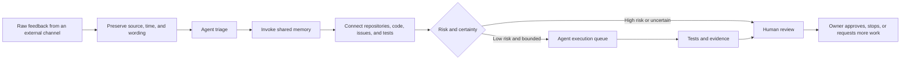

# 003 Why Can’t Traditional Hierarchies Keep Up with AI Execution Speed?

English | [中文](../zh-CN/stories/003-why-traditional-hierarchy-cannot-keep-up.md)

**By Jacky Hsu**

At eleven o’clock one night, a member of the founding team forwarded an article in WeChat.

It discussed China’s [Interim Measures for the Administration of Anthropomorphic Interactive AI Services](https://www.cac.gov.cn/2026-04/10/c_1777558395078289.htm). This was not ordinary industry news that could wait until we had time. Ingora was building an AI companion for children, with a character, voice, memory, and ongoing conversations with users. If the rules applied to us, product design, protection of minors, data processing, content safety, and algorithm filings might all need immediate changes.

In a responsible traditional company, what followed might look like this:

Concerned about missing a risk, the colleague opens a laptop late at night, reads the whole article, and searches for the original regulation. The next day, she writes a summary and sends it to her manager. The manager decides it is important and forwards it to product, legal, and technology leaders. A product manager calls a meeting to discuss the features that might be affected. The technical team waits for clear requirements. Compliance staff list actions. A project manager confirms owners, priorities, and resources.

Everyone is conscientious.

Every layer has a reason to exist.

But a regulation does not slow down because a company has a complete organization chart.

What happened at Ingora that night was different.

After receiving the message, I forwarded the article to an OpenClaw bot connected to WeChat. AI automatically found and checked the rule, then compared it with information in our knowledge base about the product’s positioning, child users, voice interactions, character memory, and data processing.

A few minutes later, a Markdown file appeared in the knowledge base.

It did not stop at a policy summary. It opened with a conclusion strong enough to alert the founding team immediately:

> Qrio’s anthropomorphic character, continuous interaction, and child-companion use case fall, in effect, 100% within the core scope of this rule.

What followed was a timeline, scope analysis, product risks, changes needed in policy and functionality, and twenty-nine internal compliance actions. The tasks were separated across product, engineering, security, operations, and management responsibilities, with owners assigned.

Several members of the founding team read it and believed we could begin acting from the list.

From the colleague’s first WeChat message to an actionable compliance analysis in the knowledge base:

Five minutes.

I later told the team that if the colleague had sent the article directly to the OpenClaw bot instead of forwarding it to me first, the five minutes people spent alerting, forwarding, and explaining might have been reduced to the final minute: everyone receives the result and decides whether to act.

This is not because the team no longer needs to be conscientious.

It is because conscientiousness should not continue to mean moving every piece of information by hand.

## What disappeared in those five minutes?

Looking only at the final compliance analysis, it is easy to conclude that “AI writes reports quickly.”

But the time compressed was not the writing time.

It was a sequence of organizational waits:

- waiting for someone to notice the message;
- waiting for someone to open the article;
- waiting for someone to find the official document;
- waiting for someone to understand how it related to the product;
- waiting for product, engineering, and compliance staff to enter the same meeting;
- waiting for responsibility to be separated;
- waiting for owners to be assigned;
- waiting for analysis to move from a chat record into a file the organization could continue to use.

The value of AI was not reducing one employee’s three hours to two.

It allowed a process that once crossed multiple roles, applications, and workdays to continue inside one context.

Article 002 described how AI can expand a person beyond one role into a super individual. This event went one step further. No single person personally served from beginning to end as policy researcher, product manager, project manager, and knowledge administrator. A communication channel triggered the task, agents handled it continuously, shared knowledge supplied context, and only then did it return to human judgment.

The subject of the work had changed.

One governance boundary must be explicit. The AI’s conclusion about regulatory scope was internal risk triage and a recommendation for action, not a legally binding opinion. The responsible owner or professional legal counsel should still review high-risk provisions. The point is not that AI made a legal decision for the company. It is that within five minutes the company knew that the matter could not be ignored, why it mattered, and who should verify what next.

Speed did not cancel responsibility.

It delivered responsibility to the right people sooner.

## Why does this company resemble an octopus?

An octopus is a remarkable animal. It has a central brain, but roughly two-thirds of its neurons are outside that brain, distributed through the nervous systems of its arms. Research shows that much sensory information and motor control is processed in those peripheral systems. The central brain sends higher-level signals, while each arm handles many control details through local touch and environmental information.

These local neural networks are sometimes described informally as “small secondary brains.” More precisely, the arms have highly distributed sensory and motor-processing capabilities, but they are not eight independent brains with separate wills. Scientific research emphasizes that the arms and central brain remain connected and coordinated. The organizational lesson is something else:

> Sensing happens at the edge. Some judgment and action happen there too. The center does not need to calculate every muscle contraction.

That is the fundamental reason for the name: distributed intelligence with a unified center.

The central brain resembles headquarters and senior leadership, responsible for overall direction, shared objectives, and coordination across arms. The arms resemble small teams closest to customers and operations, able to sense, decide, and carry out many local actions. An arm can make decisions while knowing that it belongs to one whole and moves toward a shared objective.

In 2025, AWS enterprise strategists Jana Werner and Phil Le-Brun published [“Become an Octopus Organization”](https://hbr.org/2025/11/become-an-octopus-organization) in Harvard Business Review. They used the octopus’s distributed intelligence to explain how organizations could move decisions to the edges where information lives while retaining common principles and central coordination. They later published *The Octopus Organization*. Their contrasting model was the “Tin Man Organization,” optimized for mass production, process adherence, and top-down planning—able to receive orders, but slow to adapt proactively in a complex environment.

For me, the octopus became a fitting metaphor. It connected agent architecture discussed on a stage with how a real company receives information, invokes memory, makes judgments, and drives execution every day.

The “Octopus Organization” described here is not a copy of an existing model. It is Ingora’s AI-native definition of the metaphor:

> An Octopus Organization is a human-agent system with shared memory, distributed sensing, local autonomy, and global coordination. External signals can enter through any arm. Agents interpret and advance tasks within boundaries, while people own direction, risk, and arbitration.

It has at least five characteristics:

1. **Shared direction:** the center does not issue every instruction. It defines objectives, principles, risk boundaries, and stop conditions.
2. **Shared memory:** the arms do not forget independently. Policies, products, code, customers, and past decisions enter a common knowledge foundation that each can invoke.
3. **Distributed sensing:** information enters directly from the channels where customers, partners, internal teams, and system monitoring live. A person need not first carry it into the “correct system.”
4. **Local autonomy:** agents and teams can classify, retrieve, analyze, create tasks, and validate within permission boundaries without waiting for central approval for every reversible action.
5. **Global coordination:** actions are traceable, can be checked for conflicts, and can be stopped by the center. Local speed cannot come at the price of global loss of control.

Compressed into behavior a manager can observe every day, the model has three core tests:

1. **Clear objectives, freedom in the process.** Leadership defines the desired outcome, boundaries that cannot be crossed, and evidence for acceptance. It does not approve every local step.
2. **Sensing first.** The frontline arm closest to the customer, market, or system sees change first and can immediately perform reversible actions without sending every signal up a long approval chain.
3. **Distributed innovation.** Innovation is not reserved for an R&D department or innovation lab. Every frontline team can experiment, validate, and improve its work. Learning occurs in daily operations.

Without shared memory, distribution means that no arm knows what the others are doing.

Without local autonomy, a shared knowledge base is only a prettier archive.

Without risk boundaries, autonomy becomes loss of control.

An Octopus Organization is not simply “decentralization.” It lets the center handle only what truly must be handled centrally.

## Spider, octopus, and starfish: three organizations often confused

The Octopus Organization is easily confused with two other classic metaphors: the spider and the starfish.

In *The Starfish and the Spider*, Ori Brafman and Rod Beckstrom use the spider to represent a highly centralized organization and the starfish to represent a decentralized network without a leadership center. A spider cannot function without its head. A starfish’s functions are distributed through its body, and some species have powerful regenerative abilities, making it a useful metaphor for a network without a single headquarters whose local nodes can sustain it.

These are organizational metaphors, not biological classifications. We borrow only what the starfish represents: a leaderless, replicable network structure.

| Model | Central core? | Frontline autonomy | Typical operation | Common form |
| --- | --- | --- | --- | --- |
| Spider organization | Strong center | Very low; mainly waits for instructions | Information travels upward; decisions travel downward | Traditional hierarchies and strong chains of command |
| Octopus Organization | A center responsible for strategy and boundaries | High; can decide and act quickly within boundaries | Distributed sensing, local execution, and global coordination toward shared goals | AI-native companies and empowered cross-functional teams |
| Starfish organization | No unified center | Complete or nearly complete autonomy | Nodes collaborate voluntarily; one node leaving does not paralyze the whole | Open-source communities, loose alliances, and some partner networks |

The spider’s central weakness is a single point of dependence. The edge cannot act without permission from the center.

The starfish offers resilience and openness, but it may not suit a company that needs a unified brand, legal responsibility, data governance, and product architecture.

The octopus sits between them, but it is not a compromised half-solution. It has a clear headquarters while delegating many decisions to its arms. It maintains a common direction without requiring the center to control every action. For most AI-native businesses, this “decentralization with a center” is more realistic than having no center and better able to use agent speed than a strongly centralized traditional structure.

## The dinosaur organization is not stupid

We use the “dinosaur organization” as the contrast to the octopus.

This too is an organizational metaphor, not a biological claim. We are not saying dinosaurs literally used a slow brain to control a huge body, or that traditional managers lack ability. The dinosaur organization describes a structure of information and authority: sensing happens at the edge, information travels up through layers, judgment is concentrated at the top, and commands travel back down. Each department handles only its own part of the body.

That structure was once highly effective.

When markets changed slowly, information was scarce, and professional tools were expensive, centralized decisions preserved consistency, specialized roles improved proficiency, and processes and approvals reduced errors. Large companies achieved stable production, replication, and expansion precisely by breaking complex work into clear functions.

The problem is not that the dinosaur organization failed in the past.

It is that after AI changes the external environment and speed of execution, the mechanisms that made the structure successful begin to create delay.

A regulation can be retrieved in seconds. An agent can read it, compare it with internal knowledge, and produce an action list in minutes. Coding agents can search multiple repositories, propose changes, and run tests concurrently. If those results must still wait for tomorrow’s weekly meeting, next week’s schedule, and three layers of retelling before approval, organizational speed is still determined by the slowest human handoff.

The two structures can be compared directly:

| Dimension | Dinosaur organization | Octopus Organization |
| --- | --- | --- |
| Signal entry | Designated people monitor designated systems | Signals enter directly from the channels where they appear |
| Information flow | Reported, organized, and retold layer by layer | Events trigger direct connections to shared memory and relevant capabilities |
| Context | Scattered across people, departments, and applications | Supplied by a shared knowledge foundation with sources preserved |
| Decision location | Concentrated in managers or committees | Reversible, testable decisions move to the edge |
| Execution | Departments hand work off serially | People and agents combine around tasks in parallel |
| Central responsibility | Allocate work and approve the process | Define intent, principles, permissions, and conflict arbitration |
| Failure handling | Find the responsible person and add process | Improve knowledge, tests, permissions, or feedback loops |
| Primary risk | Slow response and context lost in retelling | Local loss of control, excessive permissions, or polluted memory |

The dinosaur organization often equates “maintaining control” with “every step must pass through the center.”

The Octopus Organization redefines control: the center can see what happened, understand why the system acted, and stop or recover when necessary—without pushing every step by hand.

## Why are messaging apps the arms of the octopus?

Ingora’s internal team primarily uses Teams. The outside world does not standardize its tools around our choice.

Some partners use WeCom, others Feishu. Supply-chain or development partners may send feedback through DingTalk. International participants may use Telegram. Many relationships still happen through personal WeChat accounts.

Traditional digitalization usually asks everyone to migrate to one “standard entry point.” It looks orderly, but often creates new manual work. External partners continue speaking in their existing tools, so someone inside the company must copy, screenshot, summarize, and move the information into an internal system.

As long as information movement still depends on people, the system is not truly connected.

Ingora therefore uses OpenClaw as an agent workbench and channel gateway. The goal is not to favor one chat tool, but to support as many of the interfaces where information already appears as possible. OpenClaw’s public capabilities follow this approach: its core and plugins can connect channels including Telegram, Microsoft Teams, Feishu, DingTalk, WeChat, and WeCom. An octopus’s arms do not have to look identical. Their value is that all can sense the environment and send signals into the same nervous system.

The same should be true for a company:

- Teams is not an isolated information store;
- WeChat is not the founder’s private inbox;
- feedback in Feishu should not wait for someone to copy it into the product system;
- a hardware problem in DingTalk should not lose context inside a screenshot;
- an external signal on Telegram can enter the same analysis flow.

Supporting multiple channels is not about displaying the number of integrations.

It removes one of the smallest-looking and most stubborn forms of organizational friction: waiting for someone to move information from one place to another.

## How does one piece of feedback travel through a dinosaur organization?

Imagine an external partner sending this product feedback through Feishu:

> The child is occasionally interrupted while speaking. When they ask a second time, it works normally.

The message is ambiguous. The cause could be frontend state, network jitter, voice activity detection, the model’s interruption policy, echo from the audio hardware, or backend session management.

In a traditional process, it may begin a long journey:

1. Someone continuously monitors Feishu and notices the new message.
2. They copy it into an internal group and ask whether it should be handled.
3. A product manager asks for the device, account, time, network, and reproduction steps.
4. The partner replies hours later or the next day.
5. The product manager decides which feature area may be involved and creates a task.
6. An engineering lead holds a triage meeting to determine whether the problem belongs to the client, backend, voice, or hardware.
7. A manager confirms priority and whether resources are available that week.
8. An engineer begins looking for relevant code and logs.
9. An initial solution goes to a tester for validation.
10. The result returns to the product manager, and the original contact replies to the external partner.

Each person in the chain may spend only ten minutes.

The task may take ten days to travel through it.

The greatest cost is not labor time but the wall clock that keeps running. Worse, each retelling loses context. The original words, follow-up questions, product definition, code location, and test results scatter across systems. Even when the bug is fixed, the company may fail to preserve a complete memory of why it changed the product.

A dinosaur organization solves this problem with more coordinators.

Every additional coordination point introduces another wait and another compression of information.

## How does the same feedback move through an Octopus Organization?

The feedback workflow Ingora has designed and already operates can still begin in Feishu, DingTalk, WeCom, Teams, WeChat, or Telegram. The difference is that after a message arrives, it no longer waits for a person to carry it into the process.

The chain consists of a series of continuous actions:

First, preserve the original signal. The system records the channel, speaker, time, and exact message, separating facts from later inferences. AI does not turn ambiguous feedback into a certain conclusion.

Second, triage automatically. An agent judges whether the issue may concern software, hardware, experience, content, or compliance. A problem can enter several paths rather than being forced into one department for organizational convenience.

Third, invoke shared memory. The system searches the knowledge base—PRDs, product architecture, historical feedback, and decision records—to find the relevant area, identify similar reports, recover the design intent, and understand constraints that must not be broken.

Fourth, connect engineering facts. If software may be involved, an agent queries the relevant GitHub repository, code, past issues, and tests; proposes possible causes and changes; and creates a structured issue. The issue preserves the original feedback, supporting knowledge, affected features, reproduction conditions, and acceptance criteria.

Fifth, enter the execution queue. Low-risk tasks with explicit boundaries can be assigned to a coding agent for batch analysis, modification, and testing at night or when token costs are lower. Highly uncertain problems receive diagnosis only; the agent does not change code directly.

Sixth, people take over at critical points. Humans review changes involving architecture, privacy, compliance, major product experience, or irreversible deployment. Even when an agent completes the code and tests, the final pull request still waits for the responsible owner’s approval.

Seventh, notify the responsible domain owners by email.

The objective is not to let AI change a production system on its own after receiving one complaint.

It is to eliminate the movement, searching, repeated explanation, and queues previously carried by people, leaving human attention for the parts that truly require judgment.

## The five-minute compliance event was a complete octopus reflex

Return to the WeChat message at eleven o’clock.

It became an action list within five minutes not merely because the model could read quickly, but because four conditions existed at the same time.

WeChat was an arm. The signal did not wait until the next day to be moved into a formal system.

The knowledge base was shared memory. AI knew not only what the regulation said, but what Qrio was, whom it served, and which characters and data flows it had.

The agent had local ability to act. It could find official sources, organize provisions, compare them with the product, create a file, and break down tasks without waiting for a human instruction at every step.

The founding team carried global judgment. People checked whether the conclusion was reasonable, decided whether to act from the list, and arranged further validation of high-risk legal interpretations.

A traditional organization might take days to turn “news” into “company action.” The Octopus Organization begins connecting a signal to the company’s memory and capabilities the moment it reaches an arm.

This also contains the greatest danger of the model. If product information in the knowledge base is stale, if an agent misreads a legal provision, or if its permissions allow it to change a sensitive process directly, speed will amplify the error.

The five minutes do not prove that “AI is more professional than legal counsel.”

They prove that a company can create, within five minutes, a first action system with sources, context, owners, and a requirement for professional review.

## An Octopus Organization does not mean “no boss”

Distributed sensing and local autonomy can easily be misread as every arm acting independently.

A real Octopus Organization needs a clearer central capability. That capability simply no longer appears as approval of every step.

The center must define:

- what outcome the company is pursuing;
- which sources of facts can be trusted;
- which actions can run automatically;
- which permissions must be isolated;
- when the system must escalate to a person;
- who arbitrates when agents disagree;
- how to stop, recover, and preserve a record after failure.

Traditional hierarchies often write rules in employee handbooks and meeting minutes, then hope everyone remembers them. An Octopus Organization must turn important boundaries into rules agents can invoke and systems can check.

That is what `Human on the Loop` means. People no longer copy each piece of feedback, search for every item of knowledge, or push every task. They design and observe the loop, entering it when risk exceeds its boundaries.

The center is no longer the company’s hands and feet.

It makes sure that every hand and foot moves in the same direction.

## When the unit of company time changes, hierarchy begins to fail

The colleague working at eleven o’clock did not do one less important thing.

She noticed a regulatory signal relevant to the company and made the organization aware of it. AI did not erase her value. It took over the movement and initial decomposition that once would have consumed hours and required a relay across several people.

The founding team did not abandon responsibility either.

We read the conclusion, decided whether it justified action, and identified where professional review was still needed. We simply did not have to wait for everyone to carry the information to the same table before thinking could begin.

That is the fundamental difference between the octopus and dinosaur organizations:

The dinosaur organization concentrates intelligence, then distributes commands.

The Octopus Organization distributes sensing, memory, and action throughout the system, returning only direction, conflict, and high-risk judgment to the center.

When AI execution is measured in tokens per second, an organization cannot keep “we will discuss it at the next meeting” as its default clock.

The real competition will not occur only between model capabilities.

It will occur after two companies receive the same signal. One begins forwarding, reporting, and scheduling. The other has already completed analysis, created tasks, and delivered the parts requiring human judgment to the responsible owners.

Five minutes is not the destination.

It simply let us see for the first time how quickly a company can respond when it has shared memory, distributed arms, and bounded local autonomy.

---

Previous: [002 Why Saving 30% of Your Time Still Isn’t Enough](002-why-saving-30-percent-is-not-enough.md)

Next: [004 When AI Runs in Parallel 24/7, What Becomes the Company’s Real Bottleneck?](004-what-is-the-real-bottleneck.md)

[Star the repository](https://github.com/jackyhsu/ai-native-organization) to follow the next experiment.
