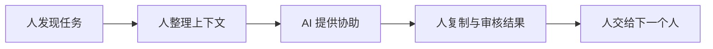

# 001 为什么装了 Copilot，仍然不是 AI 原生？

[English](../../stories/001-why-copilot-is-not-ai-native.md) | 中文

**作者：Jacky Hsu（许建志）**

Copilot 没有过时。

过时的，是我们把 Copilot 当成了终点。

2021 年，[GitHub 第一次发布 Copilot](https://github.blog/news-insights/product-news/introducing-github-copilot-ai-pair-programmer/)时，把它称为“AI pair programmer”。它读取开发者正在编写的代码，在人敲击键盘时建议下一行，甚至补出整个函数。后来，“Copilot”迅速成为一整类生成式 AI 产品的名字：人坐在驾驶座，决定方向、控制速度并对结果负责；AI 坐在副驾驶座，提供建议，协助完成工作。

在当时，这是一个先进而且必要的设计。

早期的大模型会生成令人惊艳的答案，也会一本正经地犯错；能够完成局部任务，却很难长期保持上下文；可以提出建议，却还不适合取得系统权限、独立执行连续步骤。让人握住方向盘，AI 只在旁边协助，既符合模型能力，也符合人们对责任和安全的期待。

Copilot 回答了那个时代最重要的问题：AI 怎样帮助一个人，把原来的工作做得更快？

但它也悄悄保留了一个很少被质疑的前提：工作本身不变。

公司还是原来的公司。部门、岗位、应用软件、审批流程和汇报关系都保持不变。销售在原来的 CRM 里工作，产品经理在原来的文档里写需求，工程师在原来的开发环境里写代码，管理者继续等待层层汇总。我们只是给每个人旁边多放了一位副驾驶。

这就像为一座每天塞车的城市，给每辆车都换上更强的发动机。

单车的速度提高了，城市却未必更快。

## 副驾驶范式隐藏了什么？

当人是驾驶员、AI 是副驾驶员时，一项工作的基本句法仍然是：

> 人发现任务 → 人整理上下文 → 人要求 AI 协助 → 人复制结果 → 人交给下一个人

AI 可以让“协助”这一段变得非常快，却没有自动消除任务被发现之前的等待、上下文在系统之间的搬运、部门之间的交接，以及结果产生之后的审核和执行。

它优化的是一个节点，不一定是整条链路。

这也是为什么一家公司可能为每位员工购买了 AI 工具，员工也确实写得更快、总结得更快、做简报更快，管理者却感受不到公司整体变快。有时情况甚至相反：AI 让草稿、方案和代码大量增加，审核者面前的队列随之变长；过去堵在“生产”，现在堵在“判断”。

我们可以总结一句很适合描述这个矛盾：

> 局部效率并不等于组织效率。

一位产品经理一天可以生成十份需求草稿，不代表研发团队能多交付十项功能；一位销售可以快速写出一百封开发信，不代表公司突然拥有处理一百条线索的能力；工程师写出更多代码，也不代表代码已经被正确审查、测试、部署，并为用户创造了价值。

AI 把水泵变强以后，最先发生的事情，常常不是河流变宽，而是下游开始淹水。

所以，衡量 AI 的问题不能只是“一个人节省了多少时间”。更重要的问题是：这段被节省的时间，是否穿过了整条工作流，最后变成更快、更好或过去无法实现的结果？

如果没有，Copilot 只是让旧流程跑得更用力。

## “不到 1%”不是统计，而是一种警告

今天很多人使用生成式 AI 的方式，仍然是打开一个对话框，问一个问题，等待一个答案，再把答案复制到另一个应用。模型没有公司的长期记忆，不知道一项决策的来龙去脉，不能持续观察外部变化，也没有权限完成后续动作。每次对话结束，人与 AI 之间刚刚建立的临时团队就解散了。

如果把能够调用记忆、工具和多个 Agent，能够并行工作、检查结果并根据反馈继续迭代的人称为“超级个体”，那么我们很容易产生一种直觉：一般人也许连这种能力的 1% 都还没有使用出来。

但必须说清楚：“不到 1%”不是一项可被精确测量的个人能力统计。它更适合作为一个警告——不要把偶尔聊天、生成一份文案，误认为已经触及生成式 AI 的上限。

一个更可靠的参照来自组织层面。[麦肯锡在 2024 年底调查 238 位企业高管与 3,613 位员工](https://www.mckinsey.com/capabilities/tech-and-ai/our-insights/superagency-in-the-workplace-empowering-people-to-unlock-ais-full-potential-at-work/)，虽然几乎所有企业都在投资 AI，却只有 1% 的领导者认为自己的公司已经达到 AI 应用的成熟阶段；这里的“成熟”，指 AI 已充分进入工作流，并产生显著的业务结果。

真正稀缺的不是模型账号，而是把模型接入工作的方法。

因为模型本身只提供可能性。让可能性成为生产力，还需要上下文、记忆、权限、工具、验收标准和反馈回路。缺少这些条件，再强的模型也只能一次次等待人喂给它任务；具备这些条件，同一个模型才可能从回答问题，走向承担结果。

这解释了为什么两个人使用完全相同的 AI，最后得到的并不是 20% 与 30% 的差异，而可能是数量级的差异。

一个人在等待回答。

另一个人在调度工作。

## “400 倍”究竟说明了什么？

YC 总裁兼 CEO Garry Tan 曾在一次公开演讲中比较自己 2013 年和 2026 年的 GitHub 记录，并用“大约 400 倍”描述 AI 带来的产出变化。这是一个极具传播力的数字，也很容易被误读成“AI 能把每个人变成 400 倍生产力”。

它不是一项严谨的生产力实验。

代码行数不等于产品价值；不同年份、项目和语言也不能直接比较。Tan 后来在自己公开的 [gstack 项目](https://github.com/garrytan/gstack)中更新了计算方法，改用“逻辑代码变化”而非原始行数，并主动列出 AI 会膨胀代码量等限制。按其当时公开的口径，2026 年的年化速度约为 2013 年的 810 倍；但他同时强调，重点不是谁敲了多少行，而是最终发布了什么。

因此，400、800，甚至任何一个精确倍数，都不是这里真正重要的结论。

真正值得注意的是：Tan 并不是把一个聊天机器人放在编辑器旁边，然后把字打得更快。他把产品思考、设计、工程管理、代码审查、测试、安全与发布等角色，组织成一套可以被调用、可以相互检查的虚拟团队。AI 不只回答“这段代码怎么写”，而是被安置在一条从意图到交付的工作流里。

这也呼应了 CSDN 创始人蒋涛在“硅基时间”文章中对新工作句法的描述：

> 人表达意图 → Agent 理解并规划 → Agent 并行执行 → 人审阅结果 → 给出反馈。

人与 AI 的差异，并不只是一个更会写提示词，另一个不太会。

一个人把 AI 当作答案来源；另一个人把 AI 组织成生产系统。

“超级个体”因此不是一个能同时使用很多 AI 工具的人，而是一个能够把意图转换成任务网络、让机器承担执行、让证据回到判断，并且不被机器产生的信息量淹没的人。所以创业者缺的不是 AI 工具，而是一套经营操作系统。

## 生产力的单位已经变了

在传统公司里，我们习惯用人数、工时和岗位衡量能力。一个人一天有八小时；一个团队有十个人；一项工作经过产品、设计、工程、测试和运营五种职能。公司扩大能力的常见方式，是增加更多的人，再用更多管理层连接他们。

Copilot 延续了这套生产函数。一个人仍然是一份人力，只是因为身边多了 AI，所以每小时可以多完成一些工作。

AI 原生组织提出的却是另一种可能：一个人不再只对应一个岗位，而是成为意图的来源、Agent 的调度者和结果的仲裁者；多个 Agent 可以在同一时间处理研究、设计、开发与验证；任务所需的知识不必在每次交接时重新解释，而是由组织记忆持续提供；执行过程产生的错误与反馈，又会反过来改进下一次工作。

这时，产出不再只由“有多少人、工作多久”决定，还取决于人的判断力、能够调度多少硅基时间、可以并行展开多少任务，以及反馈回路有多快。

最根本的变化，不是同一个人做得更快。

而是工作的主语改变了。

过去是“人完成任务，AI 提供帮助”；未来越来越多的工作会变成“AI 执行任务，人定义意图、设置边界、检查证据并承担责任”。人没有离开回路，却不再需要握住每一次转向。这里把这种位置称为 `Human on the Loop`：人不是消失，而是从逐步操作，提升到监督与仲裁。

这并不意味着所有工作都应该自动化，也不意味着 AI 应该拥有无限权限。恰恰相反，当机器可以执行更多动作时，人的责任边界、停止条件和可追溯性必须被设计得更清楚。

自主不是放任。

真正的自主，是在明确边界内不必等待每一次推动。

## 公司不是旧车加装一个涡轮

黄仁勋在 YC Startup School 谈“Founder Mode”时，用了一个比“副驾驶”更接近 AI 原生组织的比喻：

> CEO 就像 F1 赛车手。创始人是在造一台自己要开去比赛的赛车，并把它改造成最适合自己驾驶风格的样子。

这个比喻重要，不是因为创始人应该控制所有细节，而是因为公司从来不是一台与驾驶者无关的标准车辆。

赛车的方向盘、空气动力、悬挂、轮胎和维修站不是彼此独立的工具。它们共同构成一个为了特定目标、特定赛道和特定驾驶方式设计的系统。只换一个更强的引擎，可能让整台车更难控制；照搬另一位车手的设定，也未必适合自己。

AI 原生公司也是如此。

如果一家公司的优势来自创始人对用户、产品和风险的独特判断，那么 AI 的任务不是复制一套通用的“最佳实践”，更不是把创始人困在每一个审批节点。它应该让这种判断被表达、被保存、被调用，并在更多决策发生时产生作用。

换句话说，创始人不应成为公司永远无法绕过的瓶颈；公司却应该长成一台能放大创始人判断的机器。

这正是 Copilot 与 AI 原生之间最深的分界。

Copilot 假设车辆已经造好，只需要一位更聪明的副驾驶。

AI 原生则要求我们重新设计整台赛车：什么信号应该自动进入？哪些知识必须被长期记住？哪些任务可以并行？结果如何被验证？什么时候必须由人接管？一次失败怎样改进下一次运行？

它讨论的已经不是一个工具如何帮助一个岗位，而是一家公司应该如何运转。

## 一个残酷但有用的判断

判断一家公司是否 AI 原生，可以先做一个残酷的思想实验：

> 如果今天拿掉 AI，这家公司只是变慢，还是关键的记忆、协调与执行方式会随之失效？

如果拿掉 AI 后，组织仍能按照原来的岗位、会议、文档和审批流程照常运转，只是员工需要多花一些时间，那么这家公司大概率仍处于“AI 增强”阶段。它使用了 AI，却没有围绕 AI 的能力重新设计自己。

如果拿掉 AI 后，外部信号不再持续进入，知识无法自动关联，任务不能被并行分解，反馈与代码之间的闭环中断，组织不得不重新雇用大量人员并重建整套流程，那么它才可能开始具有 AI 原生的结构。

当然，“离不开 AI”本身并不值得骄傲。一套脆弱、不可解释、无法停止的自动化，也可能让公司离不开它。AI 原生的完整定义还必须包含人的责任、可验证的结果和可恢复的治理。这些会在后续实验中逐步展开。

但这个思想实验至少迫使我们诚实面对一件事：

装上 Copilot，是给旧公司增加一种能力；成为 AI 原生，是重新决定公司由什么构成。

前者问的是：AI 可以帮员工做什么？

后者问的是：当知识、推理与执行都可以被调度时，哪些工作还必须由人逐步完成？哪些部门边界还有存在的必要？什么应该成为公司的长期记忆？人的判断，应该出现在流程中的哪一个位置？

这不是一次软件升级。

而是一次组织基本假设的升级。

---

上一篇：[000 创始人不在，公司仍在生长](000-founder-away.md)

下一篇：[002 为什么“节省 30% 时间”仍然不够？](002-why-saving-30-percent-is-not-enough.md)

[Star 本仓库](https://github.com/jackyhsu/ai-native-organization)，继续追踪实验。
