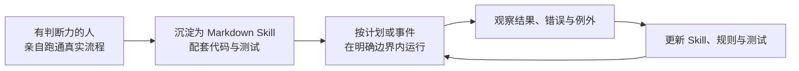

# 我们以为不需要工程师，直到发现一个三万行的文件

[English](../../stories/002-we-thought-we-didnt-need-engineers.md) | 中文

**状态：💥 失败**

**作者：Jacky Hsu（许建志）**

## 第四章：当 AI 7×24 小时并行运行，什么才是公司的真正瓶颈？

有一段时间，我们晚上最担心的问题，是 Token 不够。

白天要讨论产品功能、找合作伙伴、处理公司运营，真正能够安静下来使用 AI 的时间，往往已经到了深夜。我们看着额度一截一截下降，开始计算还剩多少次对话、多少轮修改、多少工作可以赶在限制刷新以前完成。

后来，升级模型套餐和可用额度提高了。我们遇到了一个以前很难想象的新问题：Token 居然用不完。

这本来应该让人松一口气，我们却开始为了“不要浪费”而熬夜。

再多研究一份竞品，再生成一个功能，再让 Agent 检查一次法规，再修改一个界面。电脑屏幕没有疲倦的表情，Agent 也不会提醒我们已经凌晨两点。只要继续发出指令，新的文字、代码和方案就会不断出现。

我们一度产生一种近乎危险的感觉：

如果 AI 不睡觉，Token 又足够多，公司是不是可以无限产出？

这个阶段后来有了一个很形象的名字：Tokenmaxxing，尽可能把可用 Token 转换成工作量。对于刚刚经历过第二章那种生产力震撼的创业团队，它有极强的诱惑。昨天还因为没有工程师而焦虑，今天似乎已经拥有了一支随叫随到、永不休息的数字团队。

直到我们的应用开始频繁出问题。

## 从无所不能，到“我们还是招工程师吧”

最初的问题看起来都不大。

一个功能坏了，让 AI 修。修好以后，另一个原本正常的功能又出问题。再让 AI 修第二个，第一次修复的地方却重新失效。我们像在一栋漏水的房子里奔跑：这里刚堵住，水又从另一面墙渗出来。

每一次对话里，AI 都显得很有把握。

它会解释原因，会列出修改步骤，会告诉我们测试已经通过。局部看，每一项回答都有道理；整体看，产品却越来越像一座叠床架屋、轻轻一碰就会摇晃的建筑。

合伙人的心情也像过山车。

前一刻，他还因为一个人三周完成外包团队数月的工作而觉得“好像什么都能做”；下一刻，他看着一个刚修好的功能再次失效，只能苦笑着说：

“我们还是招工程师吧。”

在 Vibe Coding 阶段，我们几乎不打开 IDE，也不看代码。

不是因为代码不重要，而是因为当时的体验太顺畅了：描述需求，等待生成，安装应用，拿起来测试。只要功能能够运行，代码就像汽车引擎盖下面的零件，驾驶者未必需要知道它们如何排列。当然，另外一方面我们也得承认我们两位看不大懂里面的代码，所以干脆不看。

问题是，我们打造的不是一辆开完一次就丢掉的纸板车。

它要持续增加功能，要连接云端服务，要处理儿童与家长的数据，要适配不同设备，还要经得起团队里不同的人、不同 Agent 在不同时间修改。终于有一天，我们意识到已经无法再安全地添加功能，于是第一次真正打开了代码好好检阅。

我们吓了一跳。

仅仅 Android 应用的前端，就已经有三万多行代码挤在同一个文件里。没有清楚的模块边界，没有按职责拆开的文件，调用后台的接口散落在不同位置；一个状态变化可能影响几个看似无关的功能。过去每一次“快速修复”，都可能在看不见的地方增加新的耦合。

三万行代码不是最可怕的。

最可怕的是，它们每一行都可能是合理需求的合理回应。

## AI 明明懂软件工程，为什么还是造出了危楼？

AI 不可能不知道 MVC、全局变量、接口抽象、模块化、分层架构、微服务或测试驱动开发。

如果你直接问它：“一个可维护的移动应用应该如何设计？”它可以在几秒内给出一份漂亮答案。如果把某段代码交给它审查，它也可能准确指出耦合、重复和状态管理的问题。

但我们当时交给它的任务不是“设计一套可以持续演化的产品架构”。

我们说的是：

- “加上这个按钮。”
- “把语音链路接起来。”
- “这个页面会闪退，赶快修好。”
- “不要影响刚才已经能用的功能。”

AI 非常努力地回答了一个又一个局部问题，却没有被要求为整个系统的长期一致性负责。它优化的是眼前这一轮对话的成功，而不是未来一百次修改之后，系统是否仍然可理解、可测试、可扩展。

这揭示了一个比“AI 会不会写代码”更重要的问题：

知识存在于模型里，不等于知识会自动成为这次任务的约束。

一个 Agent 可以知道所有软件工程原则，仍然在缺乏架构、上下文、测试和验收标准时，持续制造技术债。就像一个经验丰富的建筑师，如果每次只被要求“在这里多隔一个房间”，却看不到整栋建筑的结构图，也没有权力拒绝危险改动，最后同样可能得到一座危楼。

这也是前面提到 Vibe Coding 提高的是“造出东西”的地板；Agentic Engineering 才是真的提高“持续造产品”的天花板。

我们后来所做的，不是换一个更强的模型，而是痛定思痛，把系统推倒后重新架构：先定义模块和接口，再让 Agent 修改；先写清楚验收标准，再生成代码；让测试、静态检查、代码审查和运行反馈成为每一次开发的组成部分。

这就是 Harness Engineering 的起点：不是研究怎样对 Agent 说一句更神奇的话，而是设计一个让正确行为更容易发生、错误能够被看见并且不再重复的环境。Ingora 知识库里有一份素材把它概括得很直接：每次发现 Agent 犯错，都应该把这次错误转化成规则、测试、架构约束或反馈机制，让系统以后不必依靠某个人再次提醒。

我们以为自己缺的是更多 Token。

后来才明白，缺的是驾驭 Token 的系统。

## Token 消耗不是产出

假设 A 公司一天使用的 Token 是 B 公司的十倍。

现在的多 Agent 架构甚至允许 A 同时打开十几甚至数百个 Agent、子 Agent 或独立窗口。主 Agent 先拆分任务，其他 Agent 分批并行处理。我们自己一次分析一两百篇新闻时，就会采用这种方式：如果任务能够被合理切分，原本串行完成的工作，墙上时间理论上可以缩短到接近十分之一。

但这不能证明 A 公司的有效产出是 B 公司的十倍。

它只证明 A 消耗了十倍的计算资源。

大量硅基时间可能被花在：

- 错误方向；
- 重复工作；
- 与决策无关的 Research；
- 数量很多但无法维护的低质量代码；
- 修复上一次修复造成的问题；
- 多个 Agent 互相等待或产生冲突；
- 因为缺少上下文而重复读取、重新推理；
- 已经完成，却迟迟等不到人类 Review 的结果。

这些任务都在运行，都可能产生看起来很充实的日志，也都会消耗 Token。

但是公司没有因此向前走。

工业时代容易把“工时”误认为产出，AI 时代则容易把“Token、调用次数和生成数量”误认为产出。两种错误背后是同一件事：把投入当成结果。

真正的产出，必须通过一个更严格的检验：它有没有改变产品、客户、收入、风险、决策质量或组织下一次行动？它能不能被验证、被使用、被维护，并在失败后留下可复用的学习？

如果答案是否定的，那么十亿 Token 也可能只是在更快地制造库存。

## 五个人覆盖四五十人的职能，不等于拥有四五十人的生产力

Ingora 的创始团队只有五个人，却尝试覆盖过去可能需要四五十个人才有机会同时覆盖的范围：战略、行业调研、产品管理、交互设计、前端、后台、测试、IT、数据、运营、市场、营销、融资、财务、法务与合规等。

在没有 AI 的时代，一个五人创业团队通常必须做出非常残酷的取舍。

不是这些工作不重要，而是一开始根本没有足够的资源与人，就算有资源招聘也需要非常长的时间，新人也需要培训。团队可能有产品和技术，却没有专职研究员；有销售和运营，却没有安全工程师；能够做出功能，却没有余力每天跟踪法规、竞品和海外市场。

AI 改变的第一件事，是让小团队可以进入更多能力空间。

一个人不必先花几年成为某个职能的全职专家，才能开始理解术语、形成初稿、执行标准流程或与真正专家沟通。AI 可以帮他快速学习、拆解问题、生成第一个版本，并处理大量过去因为人手不够而永远不会开始的任务。

但“覆盖”与“精通”、“开始”与“可靠交付”不是同一件事。

我们可以借助 AI 进入软件开发，却仍然需要软件架构判断；可以进入财务和法务问题，却不能因此取代有责任资格的专业意见；可以一次生成十种营销方案，却不代表任何一种真正理解客户。

所以，更准确的说法不是“五个人拥有四五十人的生产力”，而是：

五个人第一次有机会触达过去四五十人才覆盖得了的职能版图，再把最稀缺的人类经验配置到真正决定成败的节点。

AI 可以带我们进入陌生领域，帮助我们学习原本不知道的知识；但学习需要时间，判断需要经验。如果一个人不知道何时应该怀疑、不知道什么证据才算通过，也看不出输出里的致命缺陷，AI 就无法替他凭空补出这份认知。

我们学到的沉重一课是：

AI 可以放大能力，但是无法放大你认知之外的能力。

更准确地说，AI 可以帮助你扩展认知边界，却不能让尚未形成的判断力自动生效。

如果 Vibe Coder 不知道软件工程，就不会主动要求模块边界、依赖管理、回归测试、可观测性和回滚机制；也不会知道一个“现在可以运行”的功能，距离一套能够长期迭代的 Feature Lifecycle 还有多远。

以前，一个不成熟的判断只能让一个人多走几天弯路。现在，它可以同时调动十个 Agent，在一夜之间把同一个盲点扩展成几百页报告、几万行代码和几十个彼此依赖的任务。

## 四百个你，首先仍然是“你”

就在我们经历这段过山车以后，之前提到 YC 总裁兼 CEO Garry Tan 在 a16z 的访谈里谈到一个看似相反的判断：Vibe Coding 和 Agentic Coding 可以让“任何一个人变成四百个那个人”。

“四百倍”不是经过严谨测量的生产率数字，而是一种刻意夸张的趋势表达。真正值得注意的是后半句：四百个那个人。

如果这个人拥有产品洞察、架构经验和对客户需求的判断，AI 可以让这些能力同时作用在大量任务上。

如果这个人不知道自己不知道什么，AI 也可能把同一个盲点复制四百次。

这解释了为什么 Ingora 两位远离第一线多年的负责人，仍然能够借助 Codex 快速跨回开发现场，也解释了为什么我们很快撞上工程化的墙。过去做过产品、带过大型工程团队、经历过系统上线与事故的经验没有替我们写代码，却在危楼开始摇晃时，让我们意识到问题已经不是再修一个 Bug，而是必须重建架构和 Feature Lifecycle。

AI 消除了许多“亲手执行”的门槛，却没有消除“知道该做什么、什么算好”的门槛。

后者后来被越来越多人称为 Taste——品味。

## “品味”不是审美装饰，而是压缩过的经验

在同一场访谈约十九分钟处，Garry Tan 说，随着 Coding Agent 普及，`agency` 与 `taste` 的重要性已经急剧上升。他同时强调，这两种能力不完全是天生的；人可以通过不断动手、犯错和反思来训练它们。

这里的品味，不只是界面好不好看。

它是一个人在大量真实反馈中形成的压缩判断：

- 哪一个问题值得公司投入？
- 用户说想要的功能，是否真能解决他的困难？
- 一份方案只是看起来完整，还是抓住了关键矛盾？
- 一个功能现在可以运行，还是已经具备长期维护的结构？
- 什么应该继续交给 Agent，什么必须停下来请真正的专家？

品味难以直接写进 Prompt，是因为它通常来自看过很多正确与错误的结果，并且承担过这些结果的后果。

一个资深工程师看到三万行代码集中在一个文件里，会感到危险；没有经历过大型软件迭代的人，看到的可能只是“应用仍然能打开”。一个长期与客户相处的产品负责人，会察觉一句轻描淡写的抱怨背后可能是产品定位错误；只负责摘要的 Agent，可能只会把它归类成一般反馈。

AI 可以提出判断，却无法替组织决定应该信任什么判断。

## 为什么 35–45 岁的创业者，反而可能迎来优势期？

硅谷长期偏爱年轻创业者的故事。

年轻意味着没有包袱、敢于承担风险，也还没有被大公司流程训练得过度谨慎。这些优势并没有消失。

但 Garry Tan 在访谈中指出一个正在出现的趋势：大约 35、40、45 岁、已经“been around the block”的创业者，优势正被 AI 放大。他以 Peter Steinberger 为例：这类人见过系统如何被建起来，也知道什么值得建；当执行能力被 Agent 扩展后，这种经验可以超过过去一个完整部门的覆盖范围。

年龄本身当然不是能力。

真正有价值的是年龄背后可能积累的东西：经历过完整周期，见过产品从想法到上线，处理过组织冲突、技术债、客户拒绝和商业模式失效，也知道大公司里哪些痛点长期存在，却因为成本和层级没人解决。

过去，这些经验丰富的产品负责人或技术管理者离开组织以后，仍然需要先募集资金、组建团队、补齐工程能力，才能把洞察变成产品。现在，Agent 把执行门槛压低，他们可以直接针对自己看见多年的问题开始建造。

同样的逻辑也适用于企业内部创业者。真正了解供应链、客服、财务、合规或研发流程的人，以前可能只能提交改善建议；现在，他可以先用 AI 做出可运行的工作流，让组织直接看见改变。

因此，AI 带来的并不是“经验终于战胜年轻”。

而是经验第一次不必等待一支庞大执行团队，才能转化为产品。

## 一份 Markdown 文件，什么时候才算一名员工？

Garry Tan 在访谈里还提出一句很容易传播的话：

“A markdown file is an employee.”——一份 Markdown 文件，就是一名员工。

如果只听这句话，很容易以为他在说一份文档可以取代一个人。

但他紧接着描述的流程更重要：先由人把一项业务完整做一遍；把方法沉淀成 Markdown 指令、必要的代码和测试；再把它放进定时任务重复运行。第一次通常很差，需要多次修改；以后每次出错，都像修 Bug 一样更新 Skill，让这项能力逐渐稳定。

这不是“写一份 SOP，然后交给 AI”。

它是一条把人的经验转化为组织能力的流水线：

真正的“员工”不是那份 Markdown 文件本身，而是它背后的完整系统：来源、上下文、工具权限、测试、反馈、版本和负责人。

这也正是我们在 Vibe Coding 阶段缺少的东西。

我们不断告诉 AI 下一个功能是什么，却没有把“一个功能怎样安全地走完生命周期”做成可重复的能力。如果当时已经拥有一套 Feature Lifecycle Skill，每个新功能都必须经过需求假设、架构影响分析、Spec、代码、测试、回归、发布与观测，三万行代码就很难在无人察觉的情况下堆进同一个文件。

## 重写核心变量：公司能复制多少正确经验？

这一章最初的问题是：当 AI 能够 7×24 小时并行运行，公司产出究竟由什么决定？

现在可以给出一个更接近答案的表达：

> AI 原生能力 ≈ 独特认知 × 品味与判断 × 流程可技能化程度 × 反馈迭代速度

Token、模型能力和 Agent 数量当然重要，但它们更像放大器，而不是被放大的内容。

- 独特认知：团队从真实客户、产业经验和直接实践中，知道什么值得做，以及别人尚未看见什么。
- 品味与判断：团队能区分“生成出来”“可以使用”与“值得长期保留”，也知道何时停止和升级给专家。
- 流程可技能化程度：经验能否被写成 Agent 可执行的 Skill，并配上工具、权限、测试和例外处理。
- 反馈迭代速度：失败能否迅速回到知识、规则、代码与测试中，让同一种错误不再重复发生。

如果缺少独特认知，AI 会高效生产市场不需要的东西。

如果缺少品味，组织会把“能跑”误认为“好产品”。

如果经验无法 Skill 化，专家仍然会成为每一次任务的人工瓶颈。

如果没有反馈迭代，Markdown 员工只会忠实地重复过时流程。

真正决定 AI 原生公司上限的，不是它能调用多少数字劳动力，而是它能把多少正确的人类经验，变成可复制、可验证、会进化的组织能力。

## 公司真正的瓶颈，是没有被系统化的人类经验

后来，我们不再为了把 Token 用完而特地熬夜。

不是因为 Token 不重要，而是因为我们终于理解：昂贵的不是让 Agent 再运行一小时，而是知道这一个小时应该解决什么问题、怎样才算做对，以及如何让这次判断成为下一次任务的起点。

三万行代码迫使我们打开 IDE，也迫使我们重新理解所谓“工程师的价值”。工程师不只是写代码的人。他看过系统怎样变坏，知道模块为什么要划界，知道哪些捷径会在几个月后收取利息。产品、运营、财务、法务和市场专家也是如此：真正有价值的不是职位名称，而是他们从现实中形成的判断。

AI 原生组织要做的，不是用 Agent 抹掉这些人。

而是把他们最有价值的一次判断，变成以后每一次执行都能调用的能力。

这也是“一份 Markdown 文件就是一名员工”真正激进的地方。组织扩张不再只有招聘这一条路；人可以把经验写成 Skill，让 Agent 带着它持续工作。但当 Skill 越来越多，新的问题会立刻出现：哪一份知识最新？两条规则冲突时听谁的？谁有权限修改？错误信息会不会被自动执行一百次？

所以，公司的下一项基础设施不会只是更多 Agent，也不会只是更多 Skill 文件。

它必须是一套能够保存来源、连接经验、管理版本并持续修正的共同记忆。

---

返回[实验路线图](../roadmap/experiments.md)。

[Star 本仓库](https://github.com/jackyhsu/ai-native-organization)，继续追踪实验。
