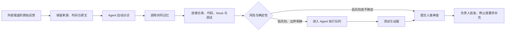

# 003 为什么传统层级跟不上 AI 的执行速度？

[English](../../stories/003-why-traditional-hierarchy-cannot-keep-up.md) | 中文

**作者：Jacky Hsu（许建志）**

晚上十一点，一位创始团队成员在微信里转发了一篇报道。

报道讨论的是[《人工智能拟人化互动服务管理暂行办法》](https://www.cac.gov.cn/2026-04/10/c_1777558395078289.htm)。这不是一条可以留到有空再看的普通行业新闻。Ingora 正在打造面向儿童的 AI Companion：它有角色、声音、记忆，会持续与用户对话。如果规定适用于我们，产品设计、未成年人保护、数据处理、内容安全和算法备案都可能需要立即调整。

在一家认真负责的传统公司里，接下来大概会发生这样的事：

同事担心遗漏风险，于是深夜打开电脑，阅读全文并寻找原始政策。第二天写出摘要，发给主管。主管认为事关重大，转给产品、法务和技术负责人。产品经理召集会议，讨论哪些功能可能受到影响；技术团队等待明确需求；合规人员列出行动清单；项目经理再确认负责人、优先级和资源。

每个人都很认真。

每一层也都有存在的理由。

但规定不会因为公司的组织图很完整，就放慢生效速度。

那天晚上，Ingora 实际发生的事情不同。

我收到消息后，把报道转发给接入微信的 OpenClaw 机器人。AI 自动寻找并核对规则，结合知识库中已有的产品定位、儿童用户、语音互动、角色记忆和数据处理方式，开始判断它与 Ingora 的关系。

几分钟后，知识库里出现了一份 Markdown 文件。

文件没有停在“政策摘要”。它先给出一句足以让创始团队立刻警觉的判断：

> Qrio 的拟人化角色、持续互动和儿童陪伴场景，实质上 100% 落入这项监管规则的核心范围。

接下来是关键时间线、适用范围、产品风险、需要修改的制度与功能，以及二十九项内部合规行动清单。任务已经按产品、工程、安全、运营和管理责任拆开，并分配到不同负责人。

几位创始团队成员看完后，认为可以直接按照清单开始推进。

从同事发出第一条微信，到知识库生成可执行的合规分析：

五分钟。

后来我对团队说，如果第一位同事不是先转给我，而是直接把报道发给 OpenClaw 机器人，人类之间用于提醒、转发和解释的五分钟，可能只需要最后一分钟：大家收到结果，判断是否执行。

这不是因为团队不再需要认真。

而是认真不应该继续等同于亲手搬运每一段信息。

## 五分钟里，究竟少掉了什么？

如果只看最后那份合规分析，很容易把这件事理解为“AI 写报告很快”。

但真正被压缩的并不是写作时间。

被压缩的是一连串组织等待：

- 等人看到消息；
- 等人打开原文；
- 等人寻找正式文件；
- 等人理解它与产品的关系；
- 等产品、技术与合规人员进入同一个会议；
- 等责任被拆分；
- 等负责人被指定；
- 等分析从聊天记录变成组织可以继续调用的文件。

AI 的价值不是把其中某一位员工的三小时工作缩短到两小时。

它让原本需要跨越多个岗位、多个应用和多个工作日的流程，在同一个上下文里连续完成。

002 讨论了 AI 如何把一个人从单一岗位扩张为超级个体。这次事件又往前走了一步：没有任何一个人从头到尾亲自承担“政策研究员、产品经理、项目经理和知识管理员”四种角色。任务是由通信软件渠道触发，由 Agent 连续处理，由共享知识提供上下文，最后才回到人类判断。

工作的主语已经改变了。

不过，这里必须加上一条治理边界。AI 在文件中给出的“落入监管范围”，是内部风险分诊与行动建议，不是具有法律效力的最终意见。高风险条款仍应由负责人或专业法律顾问复核。真正值得关注的不是 AI 替公司作了法律决定，而是它让公司在五分钟内知道：这件事不能被忽略、为什么不能忽略，以及下一步由谁验证什么。

速度没有取消责任。

速度只是把责任更早地送到了正确的人面前。

## 这种公司为什么像章鱼？

章鱼是一种很特别的生物。它当然有中央脑，但大约三分之二的神经元不在主脑，而是分布在腕足的神经系统中。研究显示，许多感觉信息与运动指令会在腕足的外围神经系统中处理；中央脑发出较高层的行动信号，腕足则根据局部触觉和环境完成大量控制细节。

这些局部神经网络有时被通俗地称为触腕的“小型次级脑”。更准确的说法是：腕足具有高度分布的感知与运动处理能力，却不是八个彼此独立、各自拥有完整意志的大脑。科学研究强调，腕足与中央脑仍然彼此连接、共同协调。真正值得组织学习的是另一件事：

> 感知发生在边缘，部分判断与动作也发生在边缘；中央不必亲自计算每一次肌肉收缩。

这就是命名最根本的原因：有统一中枢的分布式智能。

中央大脑像总部和高管层，负责整体方向、共同目标和跨腕协调；触腕像离客户与现场最近的小团队，能够自己感知、判断并完成大量局部动作。触腕可以自己作决定，却知道自己属于同一个整体，向同一个目标前进。

2025 年，亚马逊云企业战略专家 Jana Werner 与 Phil Le-Brun 在《哈佛商业评论》发表 [《Become an Octopus Organization》](https://hbr.org/2025/11/become-an-octopus-organization)，用章鱼的分布式智能说明组织如何把决策推向信息所在的边缘，同时保留共同原则与中央协调；其后出版《The Octopus Organization》。他们把对照面称为“铁皮人组织”（Tin Man Organization）：为大规模生产、流程遵循和自上而下计划而优化，能够接受指令，却难以在复杂环境中主动适应。

对我而言，章鱼成为一个非常合适的隐喻：它把台上谈论的 Agent 架构，与一家真实公司每天怎样接收信息、调用记忆、作出判断和推动执行连接起来。

这里所说的“章鱼组织”，不是照搬某一套既有模型，而是 Ingora 对这个隐喻的 AI 原生化定义：

> 章鱼组织是一套拥有共同记忆、分布式感知、局部自主和全局协调能力的人—Agent 系统。外部信号可以从任何触腕进入，Agent 在边界内理解并推动任务，人负责方向、风险与仲裁。

它至少包含五个特征：

1. **共同方向：**中央不是逐项发号施令，而是定义目标、原则、风险边界和停止条件。
2. **共同记忆：**各触腕不是各自失忆；政策、产品、代码、客户和历史决策进入同一套可调用的知识底座。
3. **分布式感知：**信息从客户、合作伙伴、内部团队和系统监控所在的渠道直接进入，不必先被人搬运到“正确系统”。
4. **局部自主：**Agent 和团队能在权限边界内分类、检索、分析、建任务和验证，不等待中央批准每一个可逆动作。
5. **全局协调：**触腕的行动可追溯、可冲突检查、可被中央停止；局部速度不会以全局失控为代价。

如果把五项结构进一步压缩成管理者每天可以观察的行为，章鱼组织只有三条核心判断：

1. **目标清晰，过程放开。**上层定义要实现的结果、不能跨越的边界和验收证据，不审批每一个局部步骤。
2. **感知前置。**最接近客户、市场和系统的一线触腕先看见变化，也有能力立即完成可逆行动，不必把所有信号送上漫长审批链。
3. **创新分布。**创新不是独立研发部或创新实验室的专属任务；每个前端团队都能试错、验证并改进自己的工作，学习发生在日常业务中。

没有共同记忆，分布式会变成彼此不知道对方在做什么。

没有局部自主，共享知识库只是一座更漂亮的档案馆。

没有风险边界，自主又会变成失控。

章鱼组织不是“去中心化”四个字，而是让中央只处理真正必须中央处理的事。

## 蜘蛛、章鱼与海星：三种经常被混淆的组织

章鱼组织最容易和另外两个经典隐喻混淆：蜘蛛组织与海星组织。

Ori Brafman 与 Rod Beckstrom 在《The Starfish and the Spider》中，用蜘蛛比喻高度中心化的组织，用海星比喻无领导中心的去中心化网络。蜘蛛失去头部就无法运作；海星的功能分布在身体各处，部分种类具有很强的再生能力，因此适合描述没有唯一总部、局部节点也能延续网络的组织。

这里谈的是组织隐喻，不是动物学分类。这里借用的只是它代表的无中心、可复制网络结构。

| 模型 | 有没有核心中枢 | 一线单元自治程度 | 典型运作方式 | 常见形态 |
| --- | --- | --- | --- | --- |
| 蜘蛛组织 | 强中枢 | 很低，主要等待指令 | 信息向上汇报，决定向下传达 | 传统科层公司、强命令链机构 |
| 章鱼组织 | 有中枢，负责战略与边界 | 高，可在边界内快速决定和行动 | 共同目标下分布式感知、局部执行、全局协调 | AI 原生企业、授权型跨职能团队 |
| 海星组织 | 没有统一中枢 | 完全或接近完全自治 | 节点自愿协作，局部退出不使整体瘫痪 | 开源社区、松散联盟、部分合伙人网络 |

蜘蛛的核心问题是单点依赖：没有中央许可，边缘无法行动。

海星的优势是韧性与开放，但它未必适合需要统一品牌、法律责任、数据治理和产品架构的公司。

章鱼位于两者之间，却不是折衷后的半套方案。它有明确总部，却把大量决策下放到触腕；它保持共同方向，却不要求中央亲自控制每一个动作。对多数 AI 原生企业来说，这种“有中心的分权”比完全无中心更现实，也比传统强中心更能利用 Agent 的速度。

## 恐龙组织并不愚蠢

与章鱼相对，这里把传统层级称为“恐龙组织”。

这同样是组织隐喻，不是生物学论断。我们不是说恐龙真的靠一个迟钝的大脑控制庞大身体，也不是说传统管理者能力不足。恐龙组织描述的是一种信息与权力结构：感知发生在边缘，信息必须逐层上报；判断集中在上层，命令再逐层下传；每个部门只处理自己负责的身体部位。

这套结构曾经非常有效。

在市场变化较慢、信息稀缺、专业工具昂贵的时代，集中决策可以保持一致，岗位分工可以提高熟练度，流程和审批可以降低错误。大型公司能够稳定生产、复制和扩张，正是因为把复杂工作拆成了明确职能。

恐龙组织的问题不是它过去失败了。

而是 AI 把外部环境和执行速度改变以后，它成功所依赖的机制开始成为延迟来源。

一条法规可以在几秒钟内被抓取；一个 Agent 可以在几分钟内读完、比对内部知识并形成行动清单；代码 Agent 可以同时检索多个仓库、提出修改并运行测试。如果这些结果仍必须等待明天的周会、下周的排期，再经过三层转述获得批准，那么组织的运行速度最终仍由最慢的人工交接决定。

可以把两种组织放在一起看：

| 维度 | 恐龙组织 | 章鱼组织 |
| --- | --- | --- |
| 信号入口 | 由专人监控指定系统 | 从信息实际出现的各渠道直接进入 |
| 信息流动 | 逐层上报、整理和转述 | 事件触发，直接连接共同记忆与相关能力 |
| 上下文 | 分散在人、部门和应用中 | 由共享知识底座提供，并保留来源 |
| 决策位置 | 尽量集中到上级或委员会 | 可逆、可验收的决定下沉到边缘 |
| 执行方式 | 部门串行交接 | 人与 Agent 按任务并行组合 |
| 中央职责 | 分配工作、审批过程 | 定义意图、原则、权限和冲突仲裁 |
| 失败处理 | 找责任人、补流程 | 补知识、测试、权限或反馈回路 |
| 主要风险 | 反应慢、上下文在转述中损失 | 局部失控、权限过宽、记忆污染 |

恐龙组织最常见的问题，是把“保持控制”理解为“每一步都必须经过中央”。

章鱼组织则把控制重新定义为：中央能够看见发生了什么，知道系统为什么行动，必要时可以停止或恢复，而不是亲手推动每一步。

## 为什么通讯软件就是章鱼的触腕？

Ingora 内部团队主要使用 Teams，但外部世界不会因为我们的选择而统一工具。

有的合作伙伴习惯企业微信，有的使用飞书；供应链或开发伙伴可能通过钉钉反馈；国际参与者可能使用 Telegram；还有大量关系仍然发生在个人微信里。

传统数字化思路通常要求大家迁移到同一个“标准入口”。它看起来整齐，实际却经常产生新的人工工作：外部伙伴仍在原来的工具里说话，公司内部必须安排一个人复制、截图、总结，再搬到内部系统。

只要信息搬运仍依赖人，系统就不是真正连通。

所以 Ingora 让 OpenClaw 成为 Agent 工作台与渠道网关，目标不是偏爱某一个聊天工具，而是尽可能支持信息本来就会出现的界面。OpenClaw 的公开能力也采用这种思路：核心与插件可以连接 Telegram、Microsoft Teams、飞书、钉钉、微信与企业微信等渠道。对章鱼来说，触腕的价值不在于长得一样，而在于它们都能感知环境，并把信号送进同一个神经系统。

对公司也是如此：

- Teams 不是一个孤立的信息仓；
- 微信不是创始人的私人收件箱；
- 飞书反馈不必等人复制到产品系统；
- 钉钉里的硬件问题不应在截图中失去上下文；
- Telegram 上的外部信号也可以进入同一条分析流程。

支持多个渠道，不是为了展示集成数量。

它是为了消除组织中最不起眼、也最顽固的摩擦：等待某个人把信息从一个地方搬到另一个地方。

## 同一条反馈，在恐龙组织里怎样旅行？

想象一个外部合作团队通过飞书提交产品反馈：

> 孩子说话时偶尔被打断，第二次再问就正常了。

这句话不够明确。它可能是前端状态问题、网络抖动、语音活动检测、模型打断策略、音频硬件回声，或者后端会话管理错误。

在传统流程中，它往往开始一场漫长旅行：

1. 有人持续监看飞书，发现新消息。
2. 他把信息复制到内部群，并询问是否需要处理。
3. 产品经理追问设备、账号、时间、网络和复现步骤。
4. 对方过几个小时或第二天回复。
5. 产品经理判断可能涉及某个功能区，建立任务。
6. 工程负责人开 triage 会议，决定属于客户端、后端、语音还是硬件。
7. 管理者确认优先级和本周是否有资源。
8. 工程师开始寻找相关代码和日志。
9. 初步方案出来后，再交给测试人员验证。
10. 结果回到产品经理，再由原来的联系人回复外部团队。

这条链路里，每个人可能只花十分钟。

任务却可能走了十天。

最昂贵的不是劳动时间，而是墙上时钟不断流逝。更糟的是，信息每经过一次转述，就丢掉一点语境：原始说法、补充问题、产品定义、代码位置、测试结果散落在不同系统中。最后即使问题修好了，公司也未必留下“为什么这样改”的完整记忆。

恐龙组织靠更多协调人员解决这个问题。

但每增加一个协调节点，也增加了一次等待与压缩。

## 同一条反馈，在章鱼组织里怎样流动？

Ingora 设计并已经在实际运作的反馈工作流，起点仍然可以是飞书、钉钉、企业微信、Teams、微信或 Telegram。区别在于，消息进入以后，不再等待一个人把它搬进流程。

这条链路可以分成几个连续动作：

第一，保留原始信号。系统保存反馈来自哪个渠道、谁在什么时间说了什么，并把事实与后续推断分开。AI 不把一句模糊反馈直接改写成确定结论。

第二，自动分诊。Agent 判断它可能属于软件、硬件、体验、内容还是合规问题。一个问题可以同时进入多条路径，而不必为了组织归属被迫只选一个部门。

第三，调用共同记忆。系统到知识库的 PRD、产品架构、历史反馈和决策记录中寻找相关功能区，判断是否已有类似问题、当前设计意图是什么、哪些约束不能破坏。

第四，连接工程事实。如果问题可能涉及软件，Agent 查询对应 GitHub 仓库、代码、历史 Issue 与测试，给出可能原因和修改建议，再建立结构化 Issue。Issue 保留原始反馈、知识依据、涉及功能、复现条件和验收标准。

第五，进入执行队列。低风险、边界明确的任务可以标记给 Coding Agent，在夜间或离峰 Token 成本较低时批量分析、修改并运行测试；高不确定性问题只做诊断，不直接改代码。

第六，人类在关键节点接管。涉及架构、隐私、合规、重大产品体验或不可逆部署的变更，由人审查。即使 Agent 完成代码和测试，最终 PR 仍然等待负责人批准。

第七，发送邮件通知相关领域负责人。

这一工作流的目标不是让 AI 在收到一句投诉后擅自修改生产系统。

它要消除的是此前由人承担的搬运、查找、重复解释和排队，把人的注意力留给真正需要判断的地方。

## 五分钟合规事件，正是一个完整的章鱼反射

现在回到晚上十一点的那条微信。

它之所以能在五分钟内变成行动清单，不只是因为模型读得快，而是四个条件同时存在：

微信是一条触腕。信号不必等到第二天被搬进正式系统。

知识库是一套共同记忆。AI 不只知道法规写了什么，也能读取 Qrio 是什么产品、服务谁、有哪些角色与数据流程。

Agent 拥有局部行动能力。它可以寻找正式来源、整理条款、比对产品、生成文件并拆分任务，不必逐步等待人指示。

创始团队承担全局判断。人检查结论是否合理，决定是否按清单执行，并对高风险法律解释安排进一步验证。

传统组织可能需要几天才把“新闻”升级成“公司行动”。章鱼组织的优势，是让信号抵达触腕的那一刻，就开始与整个公司的记忆和能力发生关系。

但这里也藏着章鱼组织最大的风险：如果知识库里的产品信息已经过期，如果 Agent 错解法律条款，如果权限允许它直接改变敏感流程，速度会放大错误。

因此，五分钟不是为了证明“AI 比法务更专业”。

它证明的是：公司可以在五分钟内形成一个有来源、有上下文、有负责人、等待专业复核的第一版行动系统。

## 章鱼组织不是“没有老板”

分布式感知和局部自主，很容易被误解成每条触腕各做各的。

真正的章鱼组织恰恰需要更清楚的中央能力，只是中央能力不再表现为对每一步的审批。

中央需要定义：

- 公司正在追求什么结果；
- 哪些事实来源可以信任；
- 哪些动作可以自动执行；
- 哪些权限必须隔离；
- 什么时候必须升级给人；
- 多个 Agent 结论冲突时谁来仲裁；
- 失败以后如何停止、恢复和留下记录。

传统层级常把规则写在员工手册和会议纪要里，再希望每个人记住。章鱼组织必须把重要边界变成 Agent 可以调用、系统可以检查的规则。

这正是 `Human on the Loop` 的含义。人不再逐条复制反馈、逐次搜索知识、逐步催促任务；人设计回路、观察回路，并在风险超过边界时进入回路。

中央不再是公司的手脚。

中央负责让所有手脚朝同一个方向行动。

## 当公司的时间单位改变，层级就开始失效

晚上十一点的同事没有少做一件重要的事。

她发现了与公司有关的法规信号，并让组织注意到它。AI 没有抹去她的价值，而是接手了过去会消耗她数小时、还需要多人接力的资料搬运和初步拆解。

创始团队也没有放弃责任。

我们阅读结论，判断它是否足以采取行动，并决定哪些地方需要进一步专业复核。只是我们不必等所有人先把信息搬到同一张桌子上，才开始思考。

这就是章鱼组织和恐龙组织最根本的差异：

恐龙组织把智能集中起来，再把命令分发出去。

章鱼组织让感知、记忆与行动分布在整个系统中，只把方向、冲突和高风险判断送回中央。

当 AI 的执行速度以 Token/秒计算，组织不能继续以“下次开会再说”作为默认时钟。

真正的竞争，不会只发生在模型能力之间。

它会发生在两家公司收到同一条信号之后：一家开始转发、汇报和排期；另一家已经完成分析、建立任务，并把需要人类判断的部分送到负责人面前。

五分钟不是终点。

它只是让我们第一次看见，一家公司如果拥有共同记忆、分布式触腕和受约束的局部自主，究竟可以反应得多快。

---

上一篇：[002 为什么“节省 30% 时间”仍然不够？](002-why-saving-30-percent-is-not-enough.md)

下一篇：[004 当 AI 7×24 小时并行运行，什么才是公司的真正瓶颈？](004-what-is-the-real-bottleneck.md)

[Star 本仓库](https://github.com/jackyhsu/ai-native-organization)，继续追踪实验。
